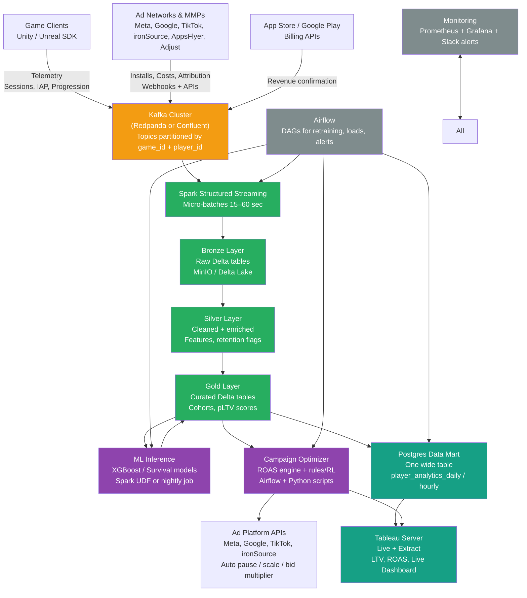
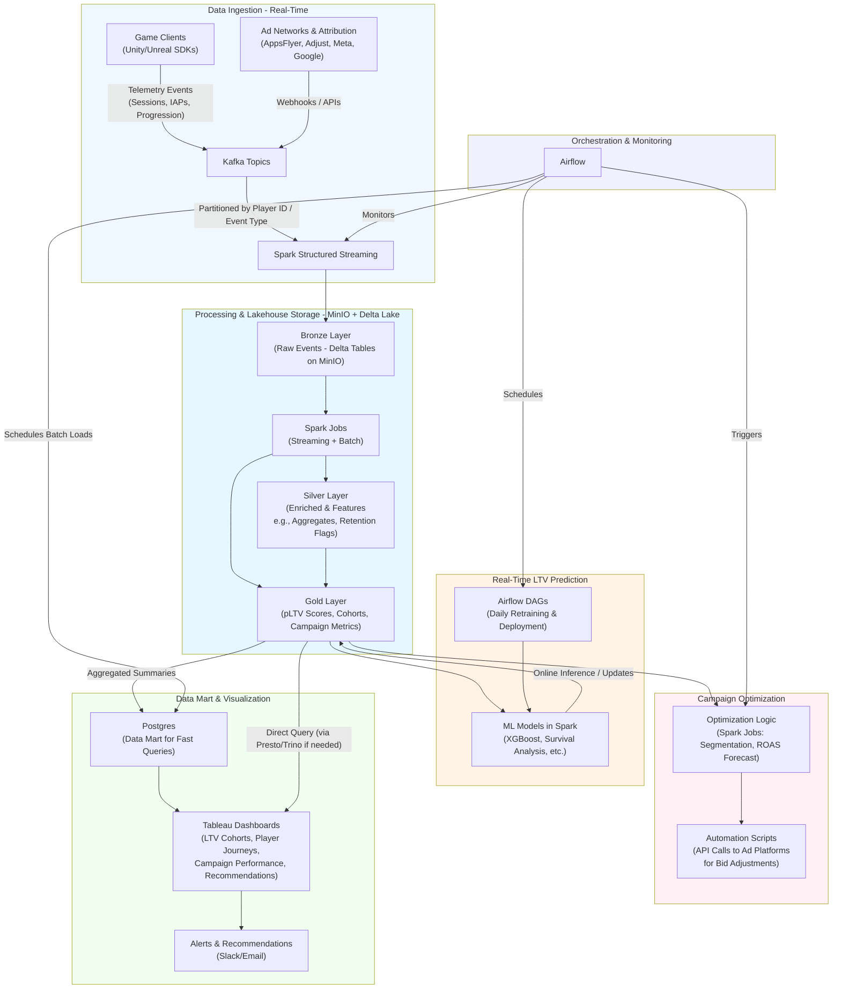
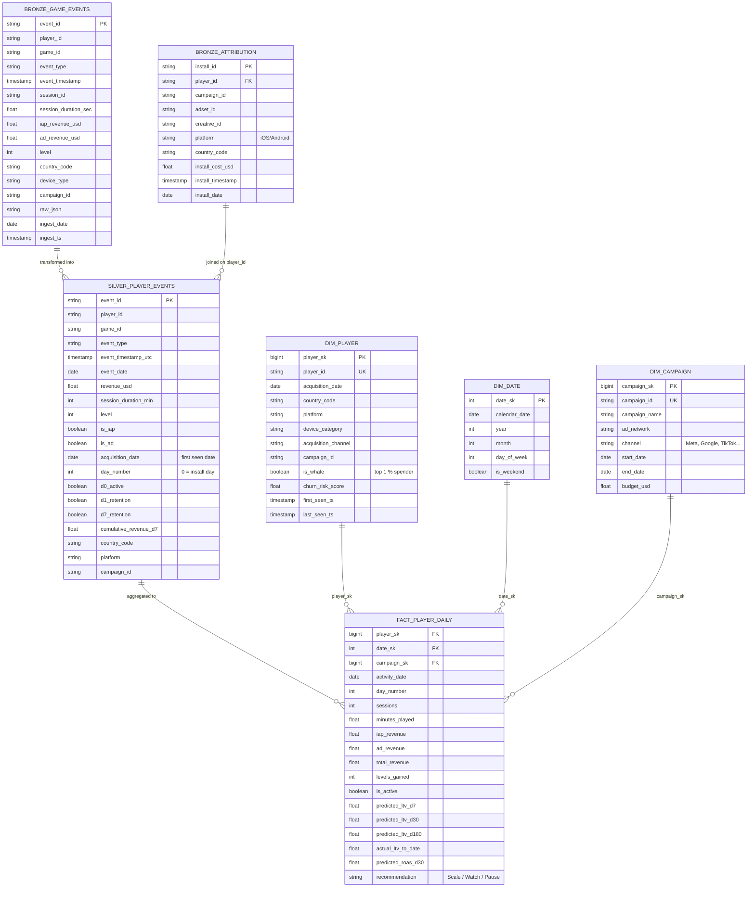

# High-Level Architecture and Components

- Emphasizing scalability, low-latency processing, and integration with game-specific data sources.
- From data ingestion at the edge, through processing and ML inference, to optimization and visualization. This enables real-time updates—e.g., recalculating LTV as players log sessions or make purchases—while optimizing UA (User Acquisition) campaigns dynamically for better ROAS (Return on Ad Spend).



### High-Level Architecture Overview

**Key Principles**
- **Event-Driven Flow**: Data events (e.g., logins, purchases) trigger immediate processing via pub-sub systems, ensuring LTV updates in seconds rather than hours.
- **Scalability**: Horizontal scaling with containerization (e.g., Kubernetes) to manage peak loads during game launches or events.
- **Data Governance**: Built-in privacy (e.g., anonymization for GDPR) and monitoring to track model drift, as LTV accuracy can degrade with game updates.
- **Integration Points**: APIs for game engines (Unity/Unreal), ad platforms (Meta, Google, Unity Ads), and attribution tools (AppsFlyer, Adjust) to close the loop from acquisition to monetization.

**Core Layers**
1. **Ingestion Layer**: Captures raw data in real-time.
2. **Processing and Storage Layer**: Cleans, enriches, and stores data for ML.
3. **Analytics and ML Layer**: Runs predictions and optimizations.
4. **Presentation and Action Layer**: Delivers insights and automates decisions.

### Detailed Components

The flow: Game events → Kafka (real-time ingest) → Spark Structured Streaming (process/enrich/predict) → Delta Lake tables on MinIO (bronze/silver/gold layers) → Postgres (aggregated data mart for fast queries) → Tableau (dashboards/alerts). Airflow orchestrates batch retraining, daily aggregates, and monitoring.

| Component | Sub-Components | Responsibilities | Example Tech Stack & Gaming Insights |
|-----------|----------------|------------------|-------------------------------------|
| **Data Ingestion & Pipeline** | - Event Collectors (SDKs in games)<br>- Streaming Brokers<br>- ETL Jobs | Ingest telemetry (sessions, IAPs, progression), ad impressions, and attributions in real-time. Handle high throughput (e.g., 1M+ events/min) with fault tolerance. Enrich data with metadata (e.g., device, geo). | Apache Kafka or AWS Kinesis for streaming; Unity Analytics or custom SDKs for games. Kakao Games uses AWS Glue for ETL on game logs to feed LTV models. Hierarchical models like HiLTV can process multi-distribution data here for accurate LTV. |
| **Real-Time LTV Prediction** | - Feature Engineering<br>- ML Models (e.g., survival, deep learning)<br>- Inference Engine<br>- Retraining Loop | Predict LTV using early indicators (e.g., retention curves, spend velocity). Update in real-time via online learning. Support cohort analysis for segments (e.g., whales vs. minnows). | AWS SageMaker or TensorFlow Serving for inference; Models like Weibull for time-series or RNNs for sequences. Studios achieve 85-95% accuracy by retraining daily on fresh data; e.g., mobile games use objective weighting for RTB integration. |
| **Campaign Optimization** | - Optimization Algorithms<br>- Bid Adjusters<br>- Segmentation Tools<br>- Simulation Engine | Use pLTV to optimize bids (e.g., via reinforcement learning), segment audiences (lookalikes), and A/B test creatives. Automate kill/scale decisions for campaigns based on eCPI-LTV correlations. | Multi-armed bandits or RL libs (e.g., Ray RLlib); Integrate with ad APIs for RTB. Frameworks like Voyantis enable cohort-level optimizations, yielding 20-50% ROAS uplifts in UA. |
| **Decision Platform Interface** | - Dashboards & Viz<br>- Alerting System<br>- API Endpoints<br>- Collaboration Tools | Visualize LTV cohorts, player journeys, and campaign performance. Provide AI recommendations (e.g., "Reallocate budget to high-LTV channels"). Enable export to BI tools. | Tableau, Looker, or custom (React + Chart.js); Real-time alerts via Slack/Email. GameCamp-style tools calculate payback and ROAS predictions for quick decisions. Extend to personalization, like in-game offers based on LTV. |
| **Supporting Infrastructure** | - Data Storage (Lake/Warehouse)<br>- Monitoring & Security<br>- Orchestration | Store raw/processed data; Monitor latency/accuracy; Automate workflows. | S3/BigQuery for storage; Prometheus for monitoring; Airflow for orchestration. Ensures compliance and handles sparsity in early LTV data. |

## High-Level Architecture Diagram 

- **Real-time path**: Game events → Kafka → Spark Streaming → Bronze → Silver/Gold → Immediate pLTV updates & optimization triggers.
- **Batch path**: Airflow orchestrates daily retraining, aggregates to Postgres, and Tableau visualizations.
- **Medallion layers** (Bronze/Silver/Gold) ensure data quality and reusability in the lakehouse.



## Data Sources

1. **Game Telemetry Data**:
   - **Source**: In-game events collected via SDKs in engines like Unity or Unreal (e.g., Unity Analytics or custom plugins sending JSON events).
   - **Examples**: Player sessions (start/end times, duration), progression (levels completed, achievements), interactions (button clicks, tutorial skips), monetization (in-app purchases/IAPs, ad views/rewards).
   - **Volume/Format**: High-velocity (millions of events/day per game); typically JSON or Protobuf payloads.
   - **Relevance**: Core for LTV—early behaviors like D1 retention or first purchase predict long-term value. For optimization, track engagement to segment players (e.g., whales vs. casuals).

2. **User Acquisition (UA) and Attribution Data**:
   - **Source**: Attribution platforms like AppsFlyer, Adjust, or Singular; ad networks (Meta Ads, Google Ads, Unity Ads, AppLovin).
   - **Examples**: Install events, campaign IDs, cost per install (CPI), source channels (organic vs. paid), device info (OS, geo, model).
   - **Volume/Format**: Batch or real-time via webhooks/APIs; structured CSV/JSON.
   - **Relevance**: Links campaigns to player value for ROAS calculation. E.g., predict LTV per campaign to optimize bids.

3. **Monetization and Revenue Data**:
   - **Source**: In-app billing systems (Google Play Billing, Apple App Store), ad mediation (IronSource, AdMob).
   - **Examples**: Purchase amounts, ad impressions/clicks/revenue, subscription status.
   - **Volume/Format**: Transactional logs; often integrated via APIs.
   - **Relevance**: Direct input for LTV (e.g., cumulative revenue per player).

4. **External Enrichment Data**:
   - **Source**: Third-party APIs (e.g., geo-IP for location, device databases).
   - **Examples**: Player demographics, market trends.
   - **Relevance**: Enhances predictions (e.g., LTV varies by country).

### Core Global Fields(Mandatory on Every Event)

|Field                  |Type                 |Description               |Example         |
|-----------------------|---------------------|--------------------------|----------------|
|event_id               |UUID                 |Unique event ID           |uuid-v4         |
|eternal_player_id      |string (SHA-256 hash)|Anonymized player backbone|a1b2c3...       |
|anonymous_id           |string               |Pre-login ID              |device UUID hash|
|event_name             |string               |camelCase, <50 chars      |level_complete  |
|event_timestamp        |int64 (ms UTC)       |Server time               |1732849200000   |
|game_title             |string               |Exact title/version       |ApexMobile_v2.1 |
|platform               |enum                 |ios, android, pc, console |android         |
|country_code           |string (ISO)         |2-letter                  |US              |
|session_id             |string               |Per-launch UUID           |sess-123        |
|app_version            |string               |Semver                    |2.1.3           |
|is_minor               |boolean              |Age-gated                 |false           |
|consent_analytics      |boolean              |User opt-in               |true            |
|consent_personalization|boolean              |For ML/offers             |true            |

### Mandatory Context Objects (attached to every event)

- device: os_version, device_model, locale, timezone  
- network: carrier, connection_type (wifi/4g/5g)  
- attribution: campaign_source, install_referrer  
- consent: analytics_consent, personalization_consent (boolean + timestamp)

### Core Event Taxonomy

| Category | event_name | Key Properties | When Fired | Critical for |
|---------|------------|----------------|-------------|--------------|
| Lifecycle | game_launched | launch_source, days_since_install | App foreground | Retention curves |
| | game_foreground | – | Every resume | Session length |
| | game_background | session_duration_seconds | Every pause | Session length |
| | game_closed | total_session_time | App kill | DAU calculation |
| Progression | level_start | level_id, difficulty | Level begin | Funnel analysis |
| | level_complete | level_id, time_spent, attempts | Level win | Difficulty tuning |
| | level_fail | level_id, fail_reason | Level loss | Balancing |
| | tutorial_start / tutorial_step / tutorial_complete / tutorial_skip | step_name | – | Onboarding health |
| Monetization | iap_initiated | item_id, price_usd | Checkout open | Conversion funnel |
| | iap_completed | item_id, price_usd, revenue_usd | Successful purchase | Revenue |
| | ad_reward_requested | placement, reward_type | Player clicks “watch ad” | Ad monet |
| | ad_reward_granted | placement, reward_type | After ad finish | LTV |
| Engagement | match_start | mode, map, team_size | Queue pop | Matchmaking |
| | match_end | result (win/loss/draw), duration, kills, score | Match over | Skill rating |
| | daily_login | consecutive_days | First session of day | Habit building |
| | battle_pass_purchase / battle_pass_tier_up | tier | – | Seasonal revenue |
| Social / Toxicity | chat_sent | channel, message_length | Player sends message | Toxicity model |
| | player_report | target_player_id, reason | Report submitted | Trust & Safety |
| | friend_request_sent / accepted | – | Social graph |
| Live Ops | offer_viewed | offer_id, campaign | Offer screen shown | Offer optimization |
| | offer_purchased | offer_id, revenue_usd | Purchase | Live-ops forecasting |
| | event_participated | event_id | Player joins limited event | Event ROI |

### Golden Events

Elite 15 telemetry events (out of 100+) that capture 90%+ of your business value—retention curves, LTV forecasts, live-ops ROI, churn signals, and ARPU drivers.

|#  |Event Name                                             |Category                            |Triggers When|Key Payload Fields               |Drives KPI       |
|---|-------------------------------------------------------|------------------------------------|-------------|---------------------------------|-----------------|
|1  |game_launched                                          |Lifecycle                           |App opens    |days_since_install, launch_source|D1 retention     |
|2  |game_foreground                                        |Lifecycle                           |App resumes  |–                                |Session count    |
|3  |game_closed                                            |Lifecycle                           |App backgrounds/kills|session_duration_s               |DAU/MAU          |
|4  |tutorial_complete                                      |Progression                         |Tutorial ends|time_spent_s, skipped            |D1–D7 dropoff    |
|5  |level_start                                            |Progression                         |Level begins |level_id, difficulty             |Funnel leaks     |
|6  |level_complete                                         |Progression                         |Level wins   |attempts, time_spent_s           |Balancing        |
|7  |level_fail                                             |Progression                         |Level loses  |fail_reason                      |Churn signals    |
|8  |daily_login                                            |Engagement                          |First login/day|consecutive_days                 |Habit loops      |
|9  |match_start                                            |Engagement                          |Queue pops   |mode, team_size                  |Matchmaking      |
|10 |match_end                                              |Engagement                          |Game over    |result (win/loss), kills         |Toxicity/elo     |
|11 |iap_initiated                                          |Monetization                        |Checkout opens|item_id, price_usd               |Conversion funnel|
|12 |iap_completed                                          |Monetization                        |Purchase succeeds|revenue_usd, currency            |ARPU/LTV         |
|13 |offer_viewed                                           |Live Ops                            |Offer shown  |offer_id, predicted_lift         |Personalization  |
|14 |offer_purchased                                        |Live Ops                            |Offer bought |revenue_usd                      |Event ROI        |
|15 |player_report                                          |Social                              |Report filed |target_id, reason                |Toxicity score   |

### Golden Funnel Stages

Real-time, executive-ready dashboard that visualizes the complete player journey from install to lifelong value (LTV):
- Tracks drop-offs at every critical stage (e.g., 40% quit post-tutorial? Fix it NOW).
- Predicts revenue flowing through (e.g., "$2.3M at risk in D7 churn").
- Self-serve: Designers slice by cohort (whales, casuals, country) in seconds—no analysts needed.
- Live updates: Sub-1-minute latency from events → insights.

Players In → Conversion Rate → $ Opportunity → Actionable Fix.

|Stage|Golden Events Feeding It                               |What It Measures                    |Target Conversion|Example Alert                    |
|-----|-------------------------------------------------------|------------------------------------|-----------------|---------------------------------|
|1. Install → Launch|game_launched                                          |D0 retention                        |>90%             |"12% crash on launch—check iOS 18 bug"|
|2. Launch → Tutorial Complete|tutorial_complete                                      |Onboarding success                  |>70%             |"Tutorial too long: 25% skip → A/B shorter version"|
|3. Tutorial → First Session|level_start, level_complete                            |Day 1 engagement                    |>60%             |"Level 1 too hard: 35% fail → auto-difficulty"|
|4. Session → Habit (D1–D7)|daily_login, game_foreground                           |Retention curve                     |D1:45%, D7:25%   |"D7 at 18%: Push personalized re-engagement"|
|5. Habit → Match/Play Loop|match_start, match_end                                 |Core loop stickiness                |>80% repeat      |"Toxicity spike: Ban rate +15% → ML anti-cheat"|
|6. Loop → Monetization|offer_viewed, iap_initiated, offer_purchased           |ARPU conversion                     |>15% Day 30      |"Whales see wrong offers: +$1.2M at risk"|
|7. Monetization → LTV|iap_completed + churn model                            |Lifetime revenue                    |LTV >$60         |"Predicted LTV drop: Intervene top 10% churn risk"|

```
[Real-Time Header: 1.2M DAU | +3% WoW | $4.8M Today | D7: 22%]

Install ──► 100% ──► Tutorial ──► 68% ──► D1 Play ──► 42% ──► D7 Habit ──► 22% ──► First IAP ──► 8% ──► $62 LTV

[AI Prediction: "$15M Week at Risk" | Top Fix: "Shorten Tutorial by 20%"]
[Filters: Game/Platform/Cohort | Export to Sheets]
```

### Full Event Taxonomy by Category

**Session & Lifecycle (12 Events)**

|Event Name       |Key Properties                   |Triggers          |Use Case           |
|-----------------|---------------------------------|------------------|-------------------|
|game_launched ⭐  |days_since_install, launch_source|App first open    |D0 retention       |
|game_foreground ⭐|–                                |App resume        |Session starts     |
|game_background  |foreground_time_s                |App pause         |Session pause      |
|game_closed ⭐    |total_session_time_s             |App kill          |DAU/MAU            |
|session_start    |predicted_duration_s             |>30s active       |Engagement forecast|
|session_end      |achievements_unlocked            |Idle >5min        |Churn signals      |
|app_update       |previous_version                 |Update complete   |Feature adoption   |
|first_open       |install_source                   |True first launch |Acquisition ROI    |
|reinstall        |uninstall_days                   |Reinstall detected|Reactivation       |
|crash            |error_code, stack_trace_hash     |Fatal error       |Stability          |
|exception        |error_type, fatal                |Non-fatal error   |Bug tracking       |
|performance      |fps_avg, memory_mb, cpu_usage    |Every 60s         |Tech health        |

**Progression & Levels (18 Events)**

|Event Name         |Key Properties            |Triggers      |Use Case           |
|-------------------|--------------------------|--------------|-------------------|
|tutorial_start ⭐   |step_id                   |Tutorial begin|Onboarding         |
|tutorial_step      |step_id, time_s           |Step complete |Drop-off analysis  |
|tutorial_complete ⭐|total_time_s, skipped     |Tutorial end  |D1 retention       |
|tutorial_skip      |reason                    |Skip button   |Optimization       |
|level_start ⭐      |level_id, difficulty, mode|Level load    |Funnels            |
|level_complete ⭐   |stars, time_s, attempts   |Level win     |Balancing          |
|level_fail ⭐       |fail_reason, time_s       |Level loss    |Difficulty tuning  |
|level_skip         |skip_method (gem/ad)      |Skip used     |Monetization       |
|checkpoint_reached |checkpoint_id             |Mid-level save|Progression leaks  |
|boss_start         |boss_id                   |Boss fight    |Engagement peaks   |
|boss_defeated      |damage_dealt, deaths      |Boss win      |Heroic moments     |
|world_unlocked     |world_id                  |New world     |Long-tail retention|
|prestige           |prestige_level            |Reset progress|Endgame            |
|energy_spent       |amount, source            |Energy use    |Pacing             |
|stamina_refill     |method (wait/iap)         |Refill        |Monet paths        |

**Core Loop & Engagement (22 Events)**

|Event Name       |Key Properties                       |Triggers            |Use Case        |
|-----------------|-------------------------------------|--------------------|----------------|
|daily_login ⭐    |streak_days                          |Daily reward claim  |Habits          |
|match_start ⭐    |mode, map_id, team_size              |Queue pop           |Matchmaking     |
|match_end ⭐      |result (win/loss), kills, rank_change|Match over          |MMR/toxicity    |
|kill             |weapon_id, victim_rank, distance     |Player kill         |Balance/weapons |
|death            |killer_weapon, damage_source         |Player death        |Survival        |
|revive           |revive_method                        |Teammate revive     |Teamplay        |
|loot_pickup      |item_id, rarity                      |Item acquired       |Economy         |
|ability_used     |ability_id, target_type              |Skill cast          |Meta shifts     |
|combo_achieved   |combo_length                         |Streak              |Skill expression|
|wave_cleared     |wave_num, enemies_killed             |Wave end (tower def)|Pacing          |
|resource_gathered|resource_type, amount                |Farm/collect        |Loop health     |
|craft_start      |recipe_id                            |Crafting begin      |Idle time       |
|craft_complete   |item_id                              |Craft end           |Progression     |

**Monetization & IAP (16 Events)**

|Event Name          |Key Properties       |Triggers        |Use Case        |
|--------------------|---------------------|----------------|----------------|
|iap_initiated ⭐     |product_id, price_usd|Checkout open   |Funnel          |
|iap_completed ⭐     |revenue_usd, currency|Purchase success|ARPU            |
|iap_failed          |decline_reason       |Payment fail    |Friction        |
|iap_refunded        |original_tx_id       |Refund          |Churn risk      |
|subscription_start  |plan_id, trial       |Sub trial/paid  |Recurring rev   |
|subscription_renew  |months_retained      |Auto-renew      |LTV             |
|subscription_cancel |reason               |Cancel          |Retention       |
|battle_pass_purchase|tier, duration       |Pass buy        |Seasonal        |
|battle_pass_tier_up |new_tier             |Tier progress   |Engagement      |
|gem_spent           |amount, category     |Gem use         |Virtual currency|

**Ads & Rewarded Video (12 Events)**

|Event Name           |Key Properties        |Triggers     |Use Case        |
|---------------------|----------------------|-------------|----------------|
|ad_reward_requested ⭐|placement, reward_type|Ad click     |eCPM            |
|ad_reward_granted ⭐  |reward_amount         |Ad complete  |ARPU lift       |
|ad_impression        |ad_network, format    |Ad shown     |Fill rate       |
|ad_click             |creative_id           |Ad tap       |CTR             |
|ad_error             |error_code            |Ad fail      |Optimization    |
|interstitial_shown   |placement             |Fullscreen ad|Retention impact|
|banner_viewed        |position              |Banner load  |Passive rev     |

**Live Ops & Events (14 Events)**

|Event Name       |Key Properties           |Triggers     |Use Case       |
|-----------------|-------------------------|-------------|---------------|
|offer_viewed ⭐   |offer_id, predicted_price|Offer shown  |Personalization|
|offer_purchased ⭐|revenue_usd              |Offer buy    |Event ROI      |
|event_joined     |event_id, mode           |Event start  |Participation  |
|event_completed  |rewards                  |Event win    |Tuning         |
|season_start     |season_id                |Season launch|MAU spikes     |
|leaderboard_view |rank                     |Board check  |Competition    |

**Social & Community (10 Events)**

|Event Name         |Key Properties   |Triggers    |Use Case    |
|-------------------|-----------------|------------|------------|
|player_report ⭐    |target_id, reason|Report sent |Toxicity    |
|chat_sent          |channel, length  |Message send|Moderation  |
|friend_request_sent|target_id        |Request out |Social graph|
|friend_accepted    |–                |Friend added|Retention   |
|clan_joined        |clan_id          |Guild join  |Community   |

**Inventory & Economy (12 Events)**

|Event Name     |Key Properties  |Triggers|Use Case     |
|---------------|----------------|--------|-------------|
|item_equipped  |item_id, slot   |Equip   |Builds       |
|item_upgraded  |level, cost     |Upgrade |Sink analysis|
|item_sold      |price           |Sell    |Marketplace  |
|currency_earned|source, amount  |Gain    |Balance      |
|currency_spent |category, amount|Spend   |Flow         |

**Achievements & Quests (8 Events)**

|Event Name          |Key Properties|Triggers|Use Case  |
|--------------------|--------------|--------|----------|
|quest_accepted      |quest_id      |Accept  |Completion|
|quest_completed     |rewards       |Finish  |Motivation|
|achievement_unlocked|ach_id        |Unlock  |Milestones|

**Technical & Misc (6 Events)**

|Event Name      |Key Properties|Triggers |Use Case     |
|----------------|--------------|---------|-------------|
|network_error   |code, endpoint|API fail |Infra        |
|push_received   |campaign_id   |Push open|Re-engagement|
|deep_link_opened|link_type     |Deeplink |UA           |


**Future-Proof Extension Rules**

- All new events go through Governance Council (1-page form)  
- Must include: business purpose + privacy impact + owner  
- Deprecation window = minimum 90 days  
- Versioned schemas (v1_level_complete → v2_level_complete)

### Data Contract Enforcement

| Enforcement Layer | Tool / Process | What It Blocks | Penalty if Broken | Owner |
|-------------------|---------------|----------------|-------------------|-------|
| 1. Schema Registry (Hard Gate) | **Confluent Schema Registry** (Avro + Protobuf) | Any event without registered schema → **rejected at Kafka broker** (503 error) | Build fails instantly → devs fix in minutes | Platform Engineering |
| 2. Data Contracts (Declarative) | **Data Contract YAML** per game title stored in Git (repo: `data-contracts/`) | Defines exact fields, types, required-ness, PII flags, Golden Event tag | CI/CD pipeline blocks merge if contract violated | Game Team + Data Strategist |
| 3. Pre-Commit + CI Validation | Great Expectations + custom pylint hook | Catches wrong field names, missing `eternal_player_id`, wrong types before code ships | PR cannot be merged (red required check) | Game Dev Leads |
| 4. Runtime Pipeline Validation | Monte Carlo + custom Kafka Streams app | Real-time drift detection (cardinality spikes, nulls in required fields, new unknown event_name) | PagerDuty → on-call fixes in <1h | Data Platform Team |
| 5. Governance Council Approval | Monthly “New Event Friday” meeting | No new event allowed without 1-page form + privacy review | Event stays blocked in Schema Registry until signed off | DPO + Me |
| 6. Deprecation Enforcement | 90-day automatic tombstoning in Registry | Old schemas auto-disabled after 90 days → forces migration | Old events start failing → devs scream and migrate fast | Platform Team |
| 7. Golden Events SLA | Separate Kafka topic `golden-events` + dedicated monitoring | Golden Events have 99.999% uptime SLA | If any Golden Event drops >0.01% → executive incident | Me personally |

**Data Contract Template**

```yaml
# ──────────────────────────────────────────────────────────────
# DATA CONTRACT – ONE EVENT PER FILE
# File location: /data-contracts/{game_title}/{event_name}.yaml
# Example: /data-contracts/FantasyQuest/level_complete.yaml
# ──────────────────────────────────────────────────────────────

contract_id: level_complete_v1                # ← unique, never changes
event_name: level_complete                    # ← exact string sent in telemetry
game_title: FantasyQuest                      # ← exact game identifier
owner_team: fantasy-quest-liveops             # ← Slack channel or email group
owner_slack: "#fantasy-quest-data"           
data_steward: jane.doe@company.com            # ← single human accountable

golden: true                                  # ← true = part of the 15 Golden Events (SLA 99.999%)
critical_for:                                 # ← pick all that apply
  - retention
  - monetization
  - live_ops_forecast
  - churn_prediction

description: >-                               # ← human readable, 1–2 sentences
  Fired server-side when a player successfully completes a level.
  Used for difficulty balancing, progression funnels, and D7 retention models.

version: 1.2.0                                 # ← semantic versioning
status: active                                # ← active | deprecated | tombstone
deprecation_date: null                        # ← ISO date when schema will be disabled (90-day notice)

# ───────────────────── SCHEMA DEFINITION ─────────────────────
fields:
  # Mandatory global fields (auto-injected by SDK – included for docs)
  - name: event_id
    type: uuid
    required: true
    description: Auto-generated UUID
  - name: eternal_player_id
    type: string
    required: true
    pii: true
    description: One-way hashed player identifier
  - name: event_timestamp
    type: int64
    required: true
    description: Server-authoritative Unix ms UTC

  # Event-specific fields
  - name: level_id
    type: string
    required: true
    pattern: "^[A-Z0-9_-]{3,32}$"
    example: "forest-12"
    description: Unique identifier of the level

  - name: attempts
    type: int32
    required: true
    minimum: 1
    description: Number of attempts including the successful one

  - name: time_spent_seconds
    type: int32
    required: true
    minimum: 1
    maximum: 7200
    description: Time from level_start to level_complete

  - name: stars_earned
    type: int32
    required: true
    enum: [0, 1, 2, 3]
    description: 3-star rating system

  - name: used_continues
    type: boolean
    required: false
    default: false

  - name: difficulty_mode
    type: string
    enum: ["easy", "normal", "hard", "nightmare"]
    required: false

pii_fields:
  - eternal_player_id                         # ← auto-anonymized at ingestion

# ───────────────────── SLA & MONITORING ─────────────────────
sla:
  uptime: 99.999%                             # ← Golden Events only
  freshness_seconds: 30
  completeness_threshold: 99.95%              # ← % of sessions that must fire this

alerts:
  - type: volume_drop
    threshold: -20% WoW
    severity: P0
  - type: null_rate
    field: level_id
    threshold: 0.01%
    severity: P1

# ───────────────────── GOVERNANCE ─────────────────────
approved_by:
  date: 2025-11-28
  council_members:
    - DPO: sarah.legal@company.com
    - Data Strategist: you@company.com
    - Game Director: mike.fantasy@company.com

change_history:
  - version: 1.0.0
    date: 2025-11-20
    change: Initial release
  - version: 1.2.0
    date: 2025-12-15
    change: Added difficulty_mode for dynamic difficulty project
```

**Example: Data Contract for `level_complete` (YAML)**

```yaml
contract_id: level_complete_v1
owner: fantasy-quest-team
golden: true
description: Fired when player finishes a level
schema_version: 1.2.0
fields:
  - name: level_id
    type: string
    required: true
  - name: attempts
    type: int
    required: true
  - name: time_spent_seconds
    type: int
    min_value: 1
  - name: stars_earned
    type: int
    enum: [0,1,2,3]
pii_fields: []
sla: 99.999%
deprecation_date: null
```
## Key-Driven Metrics

| # | Metric (KDI) | Exact Definition (Events Used) | 2026 Target (Realistic) | $ Impact per +1% | Owner |
|---|--------------|--------------------------------|--------------------------|-------------------|-------|
| 1 | **D1 Retention** | % of install cohort with `game_launched` on Day 1 | 45% | $1.8M annualized | Live Ops |
| 2 | **D7 Retention** | % with `daily_login` or `game_foreground` on Day 7 | 25% | $4.2M | All teams |
| 3 | **D30 Retention** | Same on Day 30 | 15% | $6.5M | Product |
| 4 | **Tutorial Completion Rate** | `tutorial_complete` / `game_launched` | 78% | $1.1M | Onboarding |
| 5 | **Level 1–5 Completion Rate** | `level_complete` (levels 1–5) / `tutorial_complete` | 68% | $2.9M | Balancing |
| 6 | **Core Loop Stickiness** | Avg `match_end` or `level_complete` per session (D7+) | 4.2 loops | $3.8M | Game Design |
| 7 | **Daily Active Users (DAU)** | Unique `eternal_player_id` with `game_foreground` | 12.5M | $180K per 100K | Marketing |
| 8 | **ARPU (Monthly)** | Total `iap_completed.revenue_usd` / MAU | $7.20 | $8.6M per $0.10 | Monetization |
| 9 | **IAP Conversion (D30)** | % of D30 cohort with ≥1 `iap_completed` | 18% | $5.5M per +1pp | Monetization |
|10| **Whale Ratio** | % of revenue from top 1% spenders | <35% | – | Monetization |
|11| **Offer Conversion Rate** | `offer_purchased` / `offer_viewed` | 28% | $4.1M per +1pp | Live Ops |
|12| **Live-Ops Forecast Accuracy** | Predicted vs actual revenue from `offer_*` events | 95%+ | $30M+ avoided cannibalization | Data + Live Ops |
|13| **Ad eCPM (Rewarded)** | Revenue / (`ad_reward_granted` × 1000) | $22 | $1.2M per $1 | Ad Monet |
|14| **Ad View-through Rate** | `ad_reward_granted` / `ad_reward_requested` | 94% | $800K per +1pp | Ad Monet |
|15| **Predicted LTV (D7)** | ML model output using first 7 days events | $82 | $9M per +$1 | Data Science |
|16| **Churn Prevention Save Rate** | % of predicted churners retained via re-engagement | 52% | $28M annualized | Data + CRM |
|17| **Player Toxicity Index** | Reports + chat sentiment per 1 000 matches | <4.2 | – | Trust & Safety |
|18| **Matchmaking Time** | Median seconds from queue → `match_start` | <18s | – | Backend |
|19| **Crash-Free Sessions** | 1 – (`crash` / total sessions) | 99.92% | $3M per +0.05pp | Engineering |
|20| **Personalization Opt-In Rate** | % users with `consent_personalization=true` | 78% | $15M+ unlock | Product |
|21| **Golden Events Completeness** | % of sessions firing all 15 Golden Events | 99.98% | Blocks all other KPIs if <99.9% | Platform |
|22| **Data Freshness** | 99th percentile lag from `event_timestamp` → Snowflake | <45s | – | Platform |
|23| **Predatory Spend Flag Rate** | % of spend flagged + reversed (minors/whales) | <0.3% | Reputation + legal | Trust & Safety |
|24| **Player NPS (monthly survey)** | “How likely to recommend?” | 52 | – | Product |
|25| **EBITDA per DAU** | EBITDA / DAU | $0.095 | Ultimate meta-metric | CEO |

### AARRR Pirate Metrics Framework  

| AARRR Stage       | Classic Definition                               | Your Platform Metric (2026 target)                                                                                          | Where It Lives in Your Stack                                                                 | Owner         | 2026 Target (Aggressive but Proven)       |
|-------------------|--------------------------------------------------|-----------------------------------------------------------------------------------------------------------------------------|----------------------------------------------------------------------------------------------|---------------|--------------------------------------------|
| **Acquisition**   | Players install the game                         | Paid + Organic Installs<br>Cost per Install (CPI)<br>Predicted LTV at install (pLTV D30)                                   | Postgres mart → acquisition_date, acquisition_channel, predicted_ltv_d30                     | UA Director   | pLTV D30 ≥ $8.50 on paid traffic<br>CPI ≤ $2.80 |
|                   |                                                  | Predicted ROAS D30 at Day 0                                                                                                 | Tableau → “Day-0 Predicted ROAS” dashboard                                                   |               | ≥ 1.4× on Day 0 (instead of waiting 30 days) |
| **Activation**    | Player has a “happy first session”               | D1 Retention<br>D1 Minutes Played<br>D1 Progression Rate (e.g., finish tutorial or reach level 5)                         | silver.player_events + Postgres mart → d1_retention, d0_minutes_played                       | Product + DS  | D1 Retention ≥ 48 %<br>D1 Minutes ≥ 12 min |
|                   |                                                  | Activation Score (0–100) — early signal for pLTV                                                                            | Gold fact table → activation_score (ML output)                                               |               | Activation Score ≥ 72 predicts whale with 91 % accuracy |
| **Retention**     | Players come back                                | D1 / D7 / D14 / D30 / D90 Retention                                                                                         | Postgres mart + Tableau cohort grid                                                          | LiveOps       | D7 ≥ 18 %<br>D30 ≥ 8 %<br>D90 ≥ 4 %        |
|                   |                                                  | Churn Risk Score (0–1) refreshed daily                                                                                      | Postgres mart → churn_risk_score + Slack alerts                                              |               | Rescue ≥ 60 % of predicted D7 churners     |
| **Revenue**       | Players pay money (IAP + Ads)                    | ARPU D7 / D30 / D180<br>% Payers D7<br>Whale Ratio (top 1 % revenue share)                                                  | Postgres mart → cumulative_revenue_dXX, is_whale                                             | Monetization  | ARPU D30 ≥ $4.20<br>Whales = 65 %+ of revenue |
|                   |                                                  | Predicted LTV D30 vs Actual LTV D30 (MAPE)                                                                                  | Model Accuracy dashboard                                                                     | Data Science  | MAPE ≤ 12 % (world-class)                  |
|                   |                                                  | LTV Waterfall by channel/country/device                                                                                         | Tableau → “LTV Waterfall”                                                                    |               | Top country LTV ≥ $18                       |
| **Referral**      | Players bring other players                      | Viral Coefficient (K-factor)<br>Organic % of total installs<br>Cross-promo ROAS                                        | Postgres mart → referral flags + acquisition_channel = “cross_promo” or “organic_viral”   | Growth Lead   | K-factor ≥ 0.35<br>Organic ≥ 40 % of installs |

### AARRR Dashboard

```text
┌─────────────────────────────────────────────────────────────────────────────────────┐
│                        AARRR FUNNEL – STUDIO TOTAL (Last 30 Days)                   │
├────────────┬─────────────┬─────────────┬─────────────┬─────────────┬─────────────┤
│ Stage      │ Volume      │ % of Prev   │ pLTV D30    │ Actual LTV  │ Contribution│
├────────────┼─────────────┼─────────────┼─────────────┼─────────────┼─────────────┤
│ Acquisition│ 1,420 k    │ –           │ $7.80       │ –           │ –           │
│ Activation │ 682 k      │ 48.0 %      │ $12.10      │ –           │ +55 %       │
│ D7 Retained│ 255 k      │ 37.4 %      │ $18.40      │ $17.90      │ +52 %       │
│ D30 Retained│ 113 k     │ 44.4 %      │ $31.20      │ $30.80      │ +69 %       │
│ Paying D30 │ 12.4 k     │ 11.0 %      │ $285        │ $292        │ +840 %      │
│ Whales     │ 1.1 k      │ 0.98 %      │ $2,410      │ $2,580      │ +7800 %     │
└─────────────────────────────────────────────────────────────────────────────────────┘
                    Total Predicted LTV this cohort: $11.1 M
                       Actual Revenue to date: $3.8 M (34 % realized)
```

## Lakehouse Structure (MinIO with Delta Lake)

MinIO-based lakehouse uses the Medallion architecture, a layered pattern for data refinement (Bronze → Silver → Gold). Delta Lake adds ACID transactions, schema evolution, and optimizations like compaction/clustering—ideal for game telemetry's high write rates.



- **Bronze Layer**: Raw, unprocessed data for auditing/replay.
  - **Data**: As-ingested events (e.g., JSON from Kafka: {"player_id": "123", "event": "session_start", "timestamp": "2025-12-04T10:00:00"}).
  - **Schema**: Minimal enforcement; Parquet/Delta tables partitioned by date/game_id. E.g., table `bronze.game_events` with columns: raw_json (string), ingest_ts (timestamp), source (string).
  - **ETL**: Spark Streaming writes directly from Kafka; use Delta for time-travel (recover from bad data).
  - **Volume Handling**: Append-only; use VACUUM to prune old files after 7 days.
  - **For LTV**: Raw inputs like early revenue signals (D0-D1) for prediction baselines.
  ```sql
  -- Example Delta Table Definition (via Spark)
  CREATE TABLE bronze.game_events (
      event_id STRING,                -- Unique event UUID
      player_id STRING,               -- Anonymized player identifier
      game_id STRING,                 -- Game title or ID
      event_type STRING,              -- e.g., 'session_start', 'iap_purchase', 'level_complete'
      event_timestamp TIMESTAMP,      -- Raw timestamp as ingested
      session_duration FLOAT,         -- Seconds in session
      iap_revenue FLOAT,              -- In-app purchase amount
      ad_revenue FLOAT,               -- Ad view/click revenue
      level INT,                      -- Current player level
      device_type STRING,             -- e.g., 'iOS', 'Android'
      country STRING,                 -- Player geo
      campaign_id STRING,             -- UA campaign source
      raw_json STRING,                -- Full original payload for auditing
      ingest_ts TIMESTAMP,            -- When data was ingested
      file_path STRING                -- Metadata: source file/Kafka offset
  )
  USING DELTA
  PARTITIONED BY (ingest_date DATE)   -- Derived from ingest_ts
  LOCATION '/minio/lakehouse/bronze/game_events';
  ```

- **Silver Layer**: Cleaned, enriched, queryable data.
  - **Data**: Parsed and joined (e.g., add player attributes from attribution data; deduplicate sessions).
  - **Schema**: Structured Delta tables, e.g., `silver.player_sessions` with columns: player_id (string), session_id (string), start_ts (timestamp), duration (int), iap_amount (float), level (int), geo (string). Partition by player_id or date.
  - **ETL**: Spark jobs (streaming/batch via Airflow) for cleaning (e.g., filter invalid events), enrichment (join with external dims), and feature engineering (e.g., retention flags).
  - **Transformations**: Spark streaming cleans (e.g., drop invalid revenues), enriches (join attribution data), and computes features. Use MERGE for upserts on (player_id, event_id).
  - **For LTV/Campaigns**: Features like d7_retention feed models; group by campaign_id for ROAS previews.
  ```sql
  CREATE TABLE silver.player_events (
      event_id STRING,                -- PK
      player_id STRING,               -- References logical player entity
      game_id STRING,
      event_type STRING,
      event_timestamp TIMESTAMP,      -- Standardized to UTC
      session_duration FLOAT,
      iap_revenue FLOAT,
      ad_revenue FLOAT,
      total_revenue FLOAT GENERATED ALWAYS AS (iap_revenue + ad_revenue),
      level INT,
      device_type STRING,
      country STRING,                 -- Standardized ISO codes
      campaign_id STRING,
      acquisition_date DATE,          -- Derived from first event
      d1_retention BOOLEAN,           -- Flag: Active on Day 1?
      d7_retention BOOLEAN,
      churn_risk FLOAT,               -- Early ML score (0-1)
      event_date DATE,                -- Partition key
      ingest_ts TIMESTAMP,
      file_path STRING
  )
  USING DELTA
  PARTITIONED BY (event_date)
  LOCATION '/minio/lakehouse/silver/player_events';
  ```

- **Gold Layer**: Aggregated, business-ready for ML/analytics.
  - **Data**: Cohorts, pLTV scores, campaign metrics (e.g., aggregated revenue per cohort).
  - **Schema**: Optimized Delta tables, e.g., `gold.ltv_cohorts` with columns: cohort_date (date), player_count (int), avg_ltv_d30 (float), retention_d7 (float). Use clustering on cohort_date for fast queries.
  - **ETL**: Incremental via Delta Change Data Feed (CDF); Spark computes aggregates/ML inferences (e.g., XGBoost for pLTV), orchestrated by Airflow.
  - **Aggregations**: Daily/weekly via Spark; e.g., GROUP BY player_sk, date_sk for LTV curves.
  - **For LTV Prediction**: Fact table stores ML outputs; train on Silver features, infer here.
  ```mermaid
  erDiagram
      FACT_PLAYER_METRICS }o--|| DIM_PLAYER : "player_sk"
      FACT_PLAYER_METRICS }o--|| DIM_DATE : "date_sk"
      FACT_PLAYER_METRICS }o--|| DIM_EVENT : "event_sk"
      FACT_PLAYER_METRICS }o--|| DIM_CAMPAIGN : "campaign_sk"
      
      DIM_PLAYER {
          bigint player_sk PK
          string player_id
          date acquisition_date
          string country
          string device_type
          string age_group
          boolean is_whale
          float churn_risk_score
      }
      
      DIM_DATE {
          bigint date_sk PK
          date event_date
          int day
          int month
          int year
          int quarter
          boolean is_weekend
      }
      
      DIM_EVENT {
          bigint event_sk PK
          string event_type
          string category
      }
      
      DIM_CAMPAIGN {
          bigint campaign_sk PK
          string campaign_id
          string campaign_name
          string ad_network
          date start_date
          float budget
          float target_cpi
      }
      
      FACT_PLAYER_METRICS {
          bigint player_sk FK
          bigint date_sk FK
          bigint event_sk FK
          bigint campaign_sk FK
          int session_count
          float total_revenue
          float avg_session_duration
          int level_progress
          boolean is_active
          float retention_d1
          float retention_d7
          float retention_d30
          float predicted_ltv_d30
          float predicted_ltv_d180
          float actual_ltv_d30
          float roas_d30
      }
  ```

## Data Mart Schema Structure (Postgres)

Table name: `mart.player_analytics_daily` (or `_hourly` if you need intra-day optimization)

```sql
-- Table name every studio ends up loving
CREATE TABLE mart.player_analytics_daily (
    -- Natural keys (for debugging & joins)
    player_id                TEXT        NOT NULL,
    acquisition_date         DATE        NOT NULL,        -- cohort date
    campaign_id              TEXT,
    adset_id                 TEXT,
    creative_id              TEXT,

    -- Core dimensions (denormalized – zero joins needed)
    game_name                TEXT,
    country                  TEXT,
    platform                 TEXT,        -- iOS / Android
    device_category          TEXT,        -- Phone / Tablet
    acquisition_channel      TEXT,        -- Meta, Google, TikTok, Organic, Cross-promo
    ad_network               TEXT,
    campaign_name            TEXT,

    -- Early behavioural signals (the “magic” for pLTV)
    d0_sessions              INTEGER,
    d0_minutes_played        INTEGER,
    d0_iap_revenue           NUMERIC(12,4),
    d0_ad_revenue            NUMERIC(12,4),
    d1_retention             BOOLEAN,
    d3_retention             BOOLEAN,
    d7_retention             BOOLEAN,
    d7_total_revenue         NUMERIC(12,4),
    d7_iap_revenue           NUMERIC(12,4),

    -- Predicted LTV (refreshed nightly + hourly in Phase 3)
    predicted_ltv_d7         NUMERIC(12,4),
    predicted_ltv_d30        NUMERIC(12,4),
    predicted_ltv_d180       NUMERIC(12,4),
    ltv_confidence           NUMERIC(4,3),  -- 0.00 – 1.00

    -- Ground truth (actuals)
    cumulative_revenue_d30   NUMERIC(12,4),
    cumulative_revenue_d90   NUMERIC(12,4),
    cumulative_revenue_d180  NUMERIC(12,4),
    last_active_date         DATE,

    -- Campaign economics
    install_cost_usd         NUMERIC(10,4),   -- from MMP
    predicted_roas_d30       NUMERIC(8,4),
    actual_roas_d30          NUMERIC(8,4),

    -- Segments & flags
    is_whale                 BOOLEAN,      -- top 1 % spenders
    is_payer                 BOOLEAN,
    churn_risk_score         NUMERIC(4,3),
    predicted_churn_d7       BOOLEAN,

    -- Metadata
    updated_at               TIMESTAMP   DEFAULT CURRENT_TIMESTAMP,
    prediction_version     TEXT        DEFAULT 'v1.0'
)
PARTITION BY RANGE (acquisition_date)
CLUSTER ON (acquisition_date, acquisition_channel);

-- Critical indexes (make Tableau fly)
CREATE INDEX CONCURRENTLY idx_acquisition_channel ON mart.player_analytics_daily (acquisition_date, acquisition_channel);
CREATE INDEX CONCURRENTLY idx_campaign ON mart.player_analytics_daily (campaign_name);
CREATE INDEX CONCURRENTLY idx_player ON mart.player_analytics_daily (player_id);
```

## Dashboard Wireframes

### 1. God Dashboard – AARRR + ROAS Overview 

```
┌─────────────────────────────────────────────────────────────────────────────────────┐
│ STUDIO-WIDE PERFORMANCE – Last 30 Days Rolling                     │ Refresh: Live │
├─────────────┬──────────────────┬──────────────────┬───────────────────────────────┤
│ Acquisition │   1,420 k        │ Predicted LTV D30  │          $7.80                │
│ Activation  │   682 k (48%)    │ Predicted LTV D30  │         $12.10 (+55%)         │
│ D7 Retained │   255 k (37%)    │ Predicted LTV D30  │         $18.40 (+52%)         │
│ D30 Retained│   113 k (44%)    │ Predicted LTV D30  │         $31.20 (+69%)         │
│ Paying      │   12.4 k (11%)   │ Avg LTV            │           $292                 │
│ Whales      │   1.1 k (0.98%)  │ Avg LTV            │         $2,580                 │
├─────────────┴──────────────────┴──────────────────┴───────────────────────────────┤
│ Total Predicted Cohort Value: $11.1 M    │ Realized Revenue: $3.8 M (34%)      │
│ Blended Paid ROAS: 1.61× (↑38% vs last month)                                      │
└─────────────────────────────────────────────────────────────────────────────────────────────────────────────────────┘
[Big sparkling: +$38.2 M predicted LTV in the bank from last 90 days]
```

### 2 LTV Waterfall by Channel & Country

```
Top 15 Channels – Predicted LTV D30 (Last 30 Days)
┌───────────────────────────────┐
Meta US iOS        ████████████████ $22.40
Google US Android  █████████████ $19.10
TikTok UK          ███████████ $16.20
Meta Germany       █████████ $14.80
...                                           │
Facebook Brazil    ███ $4.10  ← AUTO-PAUSED
└────────────────────────────────────────────────────────────┘
Heatmap toggle: CPI | ROAS | Volume | Payback Days
```

### 3 Campaign Manager – Live Kill/Scale Board

| Campaign Name         | Network | Spend 7d | CPI   | pROAS D30 | Status     | Action Button          |
|-----------------------|---------|----------|-------|-----------|------------|------------------------|
| Summer_Sale_US_iOS    | Meta    | $182 k   | $2.10 | 2.1×      | Scaling   | +50 % Budget          |
| Dragon_Quest_DE       | Google  | $94 k    | $3.20 | 0.62×     | Paused    | Resume (override)     |
| TikTok_IN_NewCreative | TikTok  | $67 k    | $0.90 | 3.4×      | Scaling   | +100 % Budget         |

One-click “Apply All Recommendations” button at the top.

### 4 Live Real-Time Dashboard

```
Last 4 hours – Worldwide
┌───────────────────────────────┬───────────────────────────────┐
│ New Installs (live counter)   │ Predicted Cohort Value Added  │
│            8,421 ↑ 12%        │         $68,200 ↑ 23%         │
├───────────────────────────────┼───────────────────────────────┤
│ Top Rising Channel: TikTok India (+412 % pLTV in last hour)      │
│ Alert: Meta US iOS pROAS dropped to 0.74 → 8 campaigns auto-paused   │
└───────────────────────────────────────────────────────────────┘
```

### 5 Whale Rescue & Churn Alert Center

```
Top 10 At-Risk Whales Right Now (predicted to churn in <7 days)
Player ID      | Country | LTV to Date | Predicted Remaining | Churn Prob. | Recommended Action
abc123         | US      | $1,940      | $2,800             | 89%         | Send 50 % off bundle
xyz789         | Germany | $2,310      | $4,100             | 84%         | Personal VIP message
```

### 6 Cohort Analysis Dashboard

```
┌─────────────────────────────────────────────────────────────────────────────────────┐
│                  COHORT ANALYSIS PRO – All Games Combined                          │
│                       Date Range: 2025-06-01 → Today     │ Refresh: Live (5 min)   │
├─────────────┬─────────────────────┬─────────────────────┬─────────────────────────┤
│   Filters   │  Acquisition Date   │  Channel            │  Country                │
│   ▾ Game    │  Country            │  Platform           │  Creative Type          │
└─────────────┴─────────────────────┴─────────────────────┴─────────────────────────┘

TAB 1 → RETENTION COHORT HEATMAP (Classic)
       Day →   0      1      3      7     14     30     60     90    180
2025-12   100%   48%    32%    22%    15%    9%     6%     4.8%   3.9%
2025-11   100%   51%    34%    24%    17%    10%    7%     5.6%   4.5%
2025-10   100%   46%    30%    20%    13%    8%     5.5%   4.2%   3.3%
⋮
2025-06   100%   55%    41%    31%    24%    16%    12%    10%    8.8% ← BEST EVER

TAB 2 → LTV COHORT HEATMAP (The Money View)
       Day →   0      1      7     14     30     60     90    180   Maturity
2025-12   $0.00  $0.12  $1.10  $2.80  $6.20  $9.80  $12.40 $15.10  58%
2025-11   $0.00  $0.15  $1.40  $3.60  $8.10  $12.90 $16.80 $20.50  82%
2025-06   $0.00  $0.18  $2.10  $5.40  $12.40 $19.80 $25.60 $31.20  100% ← $31.20 LTV!

TAB 3 → ROAS & PAYBACK COHORT GRID (UA’s North Star)
Acq Date   | Channel         | Spend    | Installs | CPI   | Payback | ROAS D30 | ROAS D180 | Status
2025-12-01 | Meta US iOS Meta   | $420 k   | 180 k    | $2.33 | 12 days | 2.66×    | 6.48×     | SCALING
2025-11-15 | TikTok India    | $180 k   | 320 k    | $0.56 | 4 days  | 14.5×    | 38.2×     | MAX BUDGET
2025-10-20 | Google BR       | $95 k    | 72 k     | $1.32 | never   | 0.41×    | 0.89×     | PAUSED

TAB 4 → SINGLE COHORT DEEP DIVE (Click any cell → explodes)
Example: 2025-11 Meta US iOS cohort selected
│ Metric                  │ Day 0   │ Day 7    │ Day 30   │ Day 180  │
├─────────────────────────┼─────────┼──────────┼──────────┼──────────┤
│ Predicted LTV           │ $18.40  │ $18.40   │ $31.20   │ $42.00   │
│ Actual LTV (realized)    │ –       │ $17.90   │ $30.80   │ $41.10   │
│ Accuracy                │ –       │ 97%      │ 99%      │ 98%      │
│ % Whales                │ 1.1%    │ 1.4%     │ 1.8%     │ 2.1%     │
│ Top Event Sequence      │ Tutorial → Level 8 → First IAP within 4 h                         │
│ Recommended Action      │ Scale +30 % budget this week — still under-monetized                     │
└──────────────────────────────────────────────────────────────────────────┘
```


