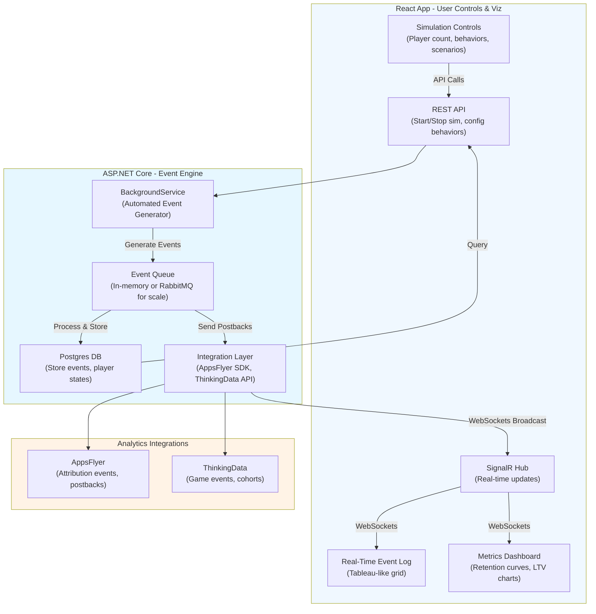

# Simulation App

Building a simulation app to mimic real-time event tracking for game studio's data pipeline, allows to test, iterate, and validate pipeline in a controlled environment without relying on live player data, which can be unpredictable, expensive to acquire, or delayed during development. This kind of simulator is common in game analytics (e.g., for stress-testing tools like AppsFlyer or ThinkingData), and it aligns perfectly with agile practices in studios like Playrix or Supercell, where they simulate player behaviors to forecast metrics like retention or ROAS before launching updates.

## Pros and Impact

- **Realism Without Risk**: Generate synthetic events (e.g., sessions, IAPs, progressions, churn) to mimic real player journeys, allowing end-to-end testing of pipeline. This is crucial for validating integrations like AppsFlyer (for attribution) and ThinkingData (for behavioral analytics) without burning ad budgets or waiting for organic traffic.
- **Cost Savings and Speed**: Simulating 10,000 "players" in minutes beats waiting weeks for real data. It helps catch issues like event schema mismatches or latency spikes early, potentially saving 20-50% on dev time and cloud costs.
- **Scalability Testing**: Use it to stress-test Postgres under high event volumes (e.g., 1M events/hour) or simulate edge cases like regional spikes during events.
- **Educational/Prototyping Tool**: Great for onboarding new data team members or demoing to stakeholders—show how a "whale" player's events flow through the pipeline to affect LTV predictions.
- **Alignment with Industry**: Tools like AppsFlyer emphasize in-app event tracking for user value insights, while ThinkingData excels in game-specific scenarios (e.g., monetization models). Your sim app could feed directly into these for realistic dashboards.

### Potential Challenges and Mitigations

- **Data Realism**: Random events might not mimic real behaviors (e.g., bursty sessions during evenings). **Mitigate**: Use probabilistic models (e.g., Poisson for session frequency) based on historical data or benchmarks from ThinkingData.
- **Latency/Scalability**: BackgroundService might bottleneck under heavy sim loads. **Mitigate**: Use async queues (e.g., RabbitMQ) or scale with multiple workers.
- **Integration Auth/Security**: AppsFlyer/ThinkingData APIs need sandbox keys. **Mitigate**: Use test environments to avoid polluting production data.
- **Frontend Usability**: React needs intuitive controls for sim parameters. **Mitigate**: Add sliders for "player count" or "churn rate" with real-time previews.
- **Maintenance**: Sim behaviors drift from real game updates. **Mitigate**: Make it configurable via JSON configs tied to game schema.

## High-Level Architecture

- **Backend (ASP.NET Core + BackgroundService)**: Use BackgroundService as the "heart" for event generation—run it as a hosted service that loops to simulate players (e.g., via timers or cron-like scheduling). Store player states (e.g., level, wallet) in Postgres for persistence. Add SignalR for real-time pushes to frontend. For scalability, queue events with Channels or RabbitMQ to handle bursts.
- **Frontend (React)**: Simple UI with sliders/dropdowns for sim params (e.g., "1000 players, 20% whales, high churn scenario"). Use Recharts for live graphs (retention heatmaps, event timelines). WebSockets via SignalR client for instant updates.
- **Postgres Schema**: A simple star schema—`players` (ID, attributes), `events` (timestamp, type, player_id, payload), `sim_sessions` (run metadata). Partition `events` by date for query speed.
- **Deployment**: Dockerize for easy local/prod runs. Use EF Core for ORM.

## Automated Player Behavior Generation

- **Player Archetypes**: Define profiles (e.g., "Casual: 2 sessions/day, low spend"; "Whale: 10 sessions, high IAP probability"). Use libraries like Bogus (Faker for .NET) for randomization.
- **Event Streams**: In BackgroundService, loop over players and emit events probabilistically (e.g., 70% chance of session_start, Poisson-distributed durations). Simulate sequences: tutorial → levels → IAP.
- **Realism Tweaks**: Add variability (e.g., geo-based behaviors via IP simulation), time-of-day spikes, or A/B test splits. Generate 1K-10K players for scale tests.
- **Edge Cases**: Include anomalies like crashes, refunds, or multi-device logins to test pipeline robustness.

## Integrations with ThinkingData and AppsFlyer

- **AppsFlyer**: Use their .NET SDK for event logging (e.g., `AppsFlyerSDK.AppsFlyer.sendEvent("session_start", params)`). Simulate attribution by generating fake install events with campaign IDs. Enable postbacks to mimic ROAS feedback—test scenarios like "low-quality traffic" with high churn.
- **ThinkingData**: Integrate via their API/SDK for game-specific events (e.g., `ThinkingAnalyticsSDK.Instance.Track("iap_purchase", properties)`). Simulation app can feed cohorts directly, allowing to view simulated LTV/retention in dashboard. Focus on genre-specific logic (e.g., hyper-casual vs. RPG behaviors).
- **Tips**: Use sandbox modes for both to avoid costs. Log responses in Postgres for debugging. Rate-limit sim events to match API quotas.
